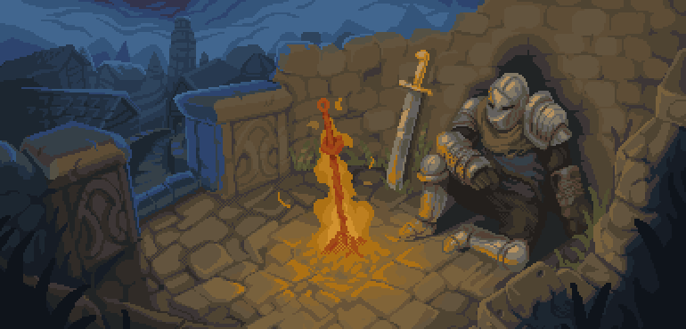

<div id=banner align=center>
  
</div>

## Hello there! 👋 I'm Matthew
I'm a computer programming hobbyist and a university student, currently majoring in computational linguistics.

### A Bit More About Me
```toml
[users.mattaroni]
name = "matthew"
pronouns = "he/him"
hobbies = ["gunpla building", "programming", "video games"]
```

### Languages & Tools


